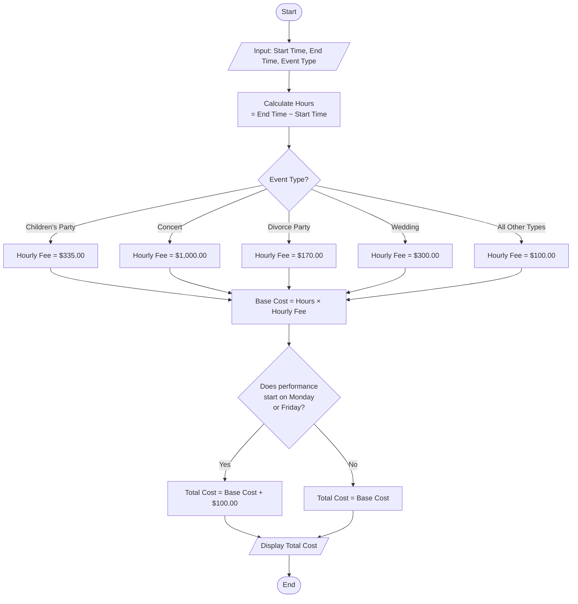

```mermaid
flowchart TD
    A([Start]) --> B[/Input: Start Time, End Time, Event Type/]
    B --> C["Calculate Hours\n= End Time − Start Time"]
    C --> D{Event Type?}

    D -->|Children's Party| E["Hourly Fee = $335.00"]
    D -->|Concert| F["Hourly Fee = $1,000.00"]
    D -->|Divorce Party| G["Hourly Fee = $170.00"]
    D -->|Wedding| H["Hourly Fee = $300.00"]
    D -->|All Other Types| I["Hourly Fee = $100.00"]

    E --> J["Base Cost = Hours × Hourly Fee"]
    F --> J
    G --> J
    H --> J
    I --> J

    J --> K{Does performance\nstart on Monday\nor Friday?}
    K -->|Yes| L["Total Cost = Base Cost + $100.00"]
    K -->|No| M["Total Cost = Base Cost"]

    L --> N[/Display Total Cost/]
    M --> N
    N --> O([End])
```